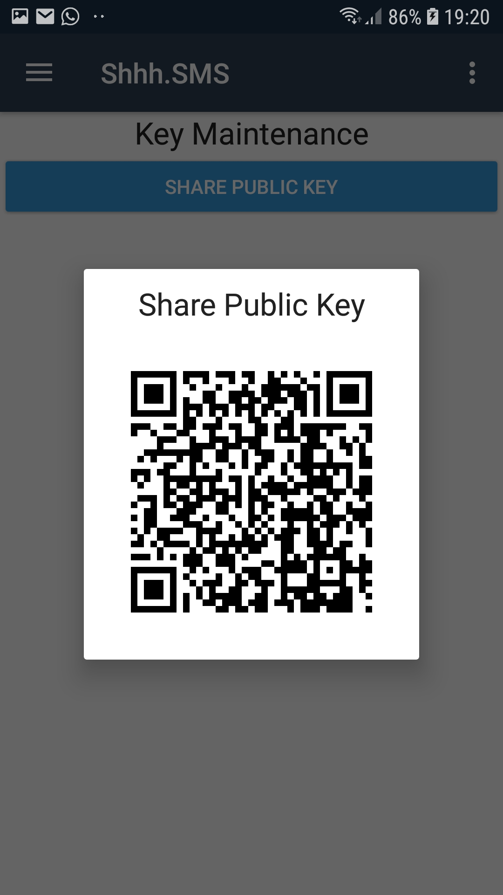
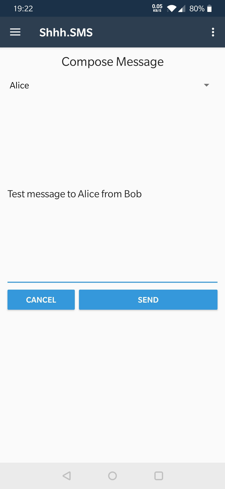
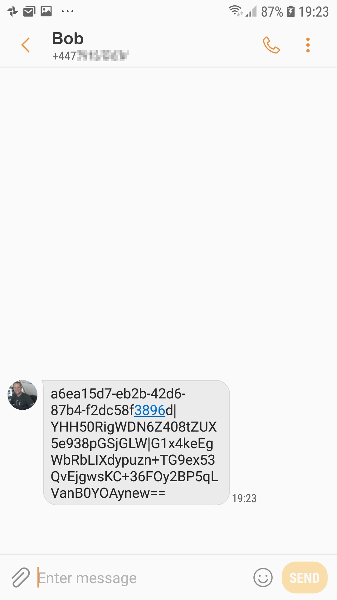
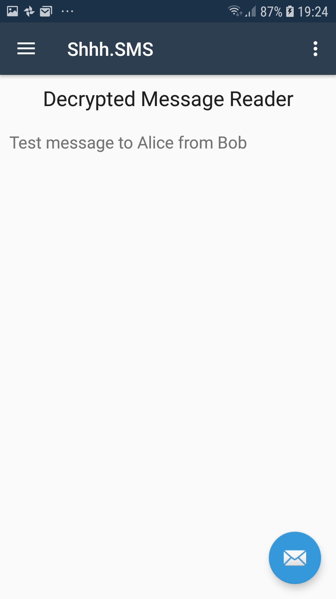

# ShhhSMS (THIS IS A WORKING PROOF OF CONCEPT)
This is a PROOF OF CONCEPT Xamarin.Android Application facilitating the sending and receiving of encrypted SMS messages. It is not intended to be production ready or a best practice example. It mearly demonstrates what can be achieved by a regular programmer with readily available tools and libraries.

You can find more information on my blog at: https://onthefencedevelopment.com/2020/06/04/sending-secure-sms-thats-crazy-talk/ 

## Overview
Governments around the world are putting a lot of pressure on 'the big technology companies' like WhatsApp to put backdoors into their applications or somehow weaken the levels of encryption but I feel that this is misguided.

Fortunately the technology companies are pushing back but how long will they be able to keep this up?

The problem is that if say WhatsApp were to reduce the levels of privacy provided by their platform then the bad guys would just move onto something else - leaving the rest of us on a hobbled platform, at the mercy of hackers etc.

I've previously written a command line utility that will encrypt text and binary data using the libSodium encryption library. But while us "techies" may be comfortable on the Command Line, the general public are not - and privacy should be for everyone.

So, in an effort to demonstrate the futility of hobbling platforms such as WhatsApp, this project with aim to show that the encryption genie is very much out of the bottle and cannot be put back in.

## How it works

### Key Exchange & Maintenance
When logging in the app will generate a set of encryption keys, one private and one public. To send and receive messages you will need to share your public key with the recipient and they will need to share theirs with you.

#### Sharing Your Public Key
* Open the Key Maintenance page
* Tap the 'Share Public Key' button
* A QR code will now be displayed which can be scanned by another user to add you as a contact

#### Adding a Contact
* Open the Contacts page
* Tap the 'Add Contact' button
* Scan the contacts QR code containing their public key
* Enter the contacts name
* Tap the 'Save' button

The contact is now added to Shhh.SMS and you can send them encrypted messages. Note that they will need to scan your public key in order to verify and decrypt your messages.

### Sending Messages
* Select the 'Compose' option from the menu or click the compose button to the bottom right of the screen if it is displayed.
* Using the dropdown, select the intended recipient for this message
* Enter the message
* Click Send

Your devices SMS application will now open and ask you to select the recipient of the message from your contact list - or allow you to add a number manually.

Once this has been done, send the message as you would with any other.

### Receiving Messages

When a message is received it needs to be 'Shared' with the Shhh.SMS application. 
* Long press the message
* Select 'Share' from the resulting menu
* Select the 'Shhh.SMS' application

## The Benefits
The key difference here is that the the app uses the mobile carriers SMS channel to send the messages and they are not responsible for any part of the encryption - so they cannot be pressured to provide access to the decrypted text.
